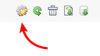
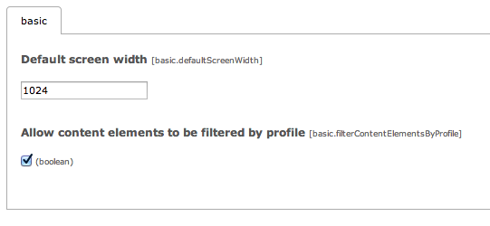

..  Editor configuration
    ...................................................
    * utf-8 with BOM as encoding
    * tab indent with 4 characters for code snippet.
    * optional: soft carriage return preferred.

.. include:: /Includes/MainInclude.txt

================================
Installation & Setup
================================

-   Make sure you are running on TYPO3 6.1 or above
-   Install the Adaptive Profiles extension (bn_adaptiveprofiles)
-	In the extension manager, click the configuration icon for Adaptive Profiles. Set the basic Default Screen Width. This almost always should be 1024. Also, indicate whether you want content elements to be filtered by Adaptive Profiles.

- 	In your main TypoScript template enter:

	page.config.tx_bnadaptiveprofiles.enable = 1
