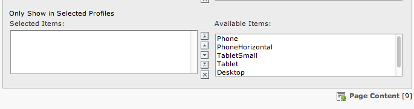
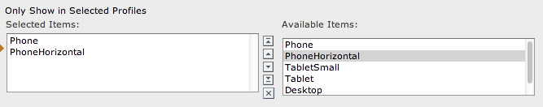

..  Editor configuration
    ...................................................
    * utf-8 with BOM as encoding
    * tab indent with 4 characters for code snippet.
    * optional: soft carriage return preferred.

.. include:: /Includes/MainInclude.txt

Filtering content elements
================================

In addition using profiles to controll overall rendering of the page, you can also control under which profiles a content element will show.

You have to have checked "Allow content elements to be filtered by profile" in the extension configuration.

.. figure:: /Images/EMOptions.png
	:alt: Extension Manger Options
	:align: left

You now have the ability in the access tab of a content element to only show it under certain profiles.

Leaving the selection blank will have the content element show always.

Selecting only Phone and PhoneHorizontal means the content will only show under those profiles (small screens)

