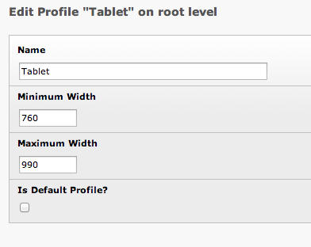

..  Editor configuration
    ...................................................
    * utf-8 with BOM as encoding
    * tab indent with 4 characters for code snippet.
    * optional: soft carriage return preferred.

.. include:: /Includes/MainInclude.txt

================================
Create Profiles
================================

-
    In the list module, go to the root of your TYPO3 installation and add a new Adaptive Profile record. This the root of your TYPO3 installation not the root page of your site.

    .. figure:: Images/AddProfile.png
        :alt: Update Database
        :align: left

    .. figure:: Images/EmptyProfile.png
        :alt: Update Database
        :align: left

-   Give your profile a name. Profiles cannot have spaces and are case sensitive.

-	Give the profile a Minimum and Maximum width which will the be range you want the profile to cover. If it is the profile for the smallest screen then you can leave minimum blank.
-   Indicate if this is the default profile. You should only have one default for the site.

-   Save the profile.

Examples of common profiles
================================

Desktop
--------------------------------

This desktop profile is also marked as the default.

DesktopBig
--------------------------------

Tablet
--------------------------------

TabletSmall
--------------------------------

PhoneHorizontal
--------------------------------

Phone
--------------------------------

